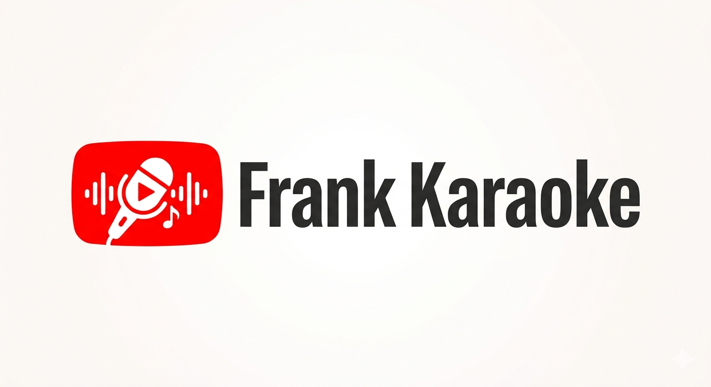
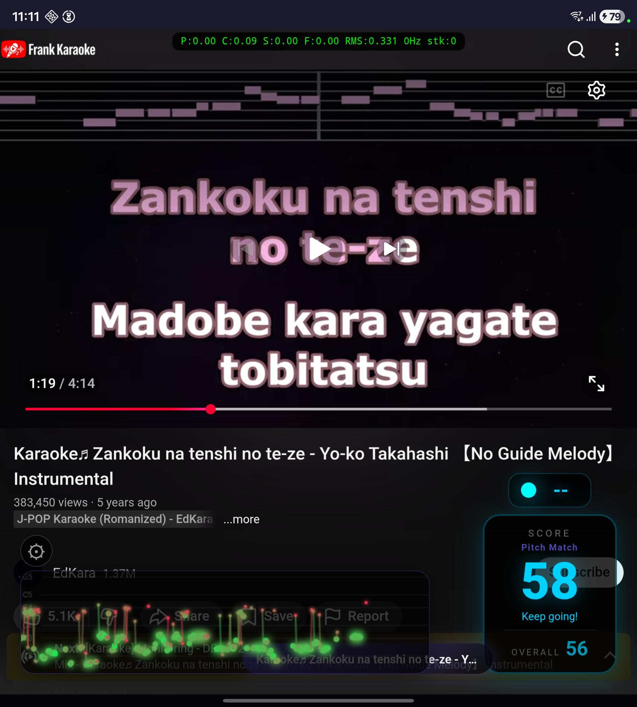
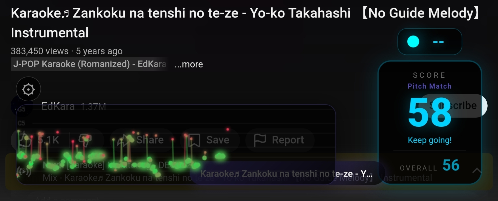
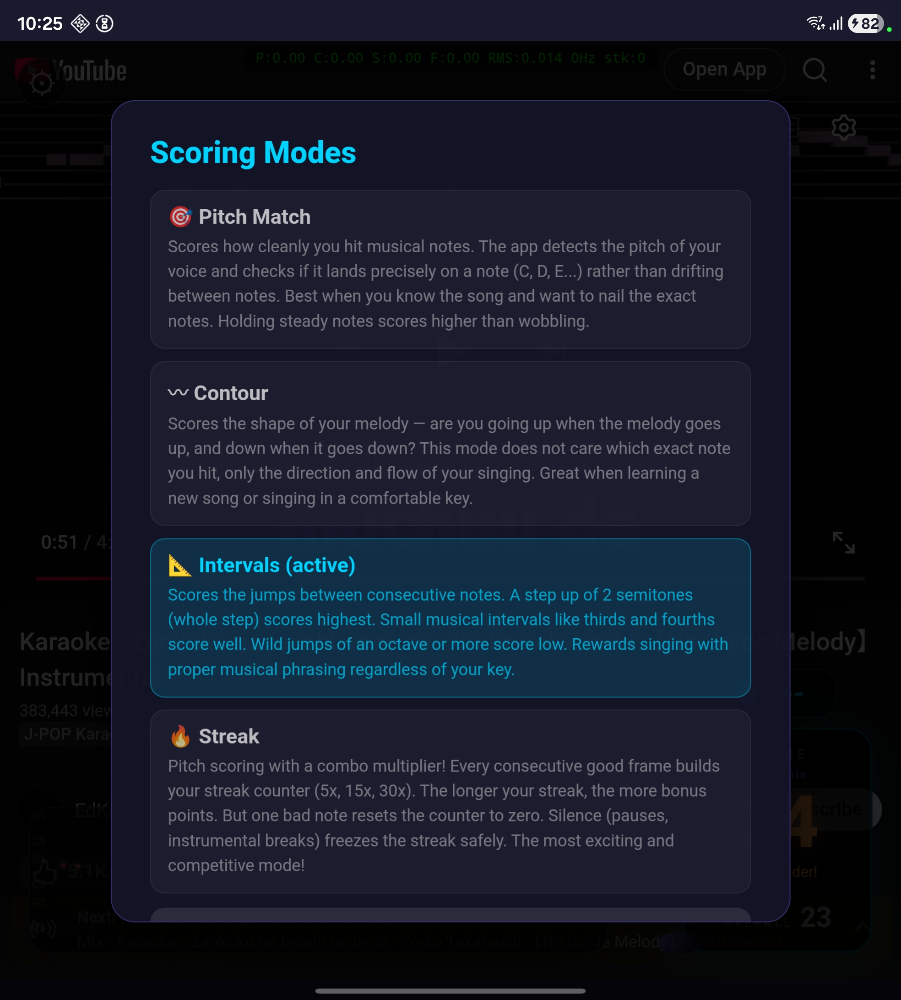
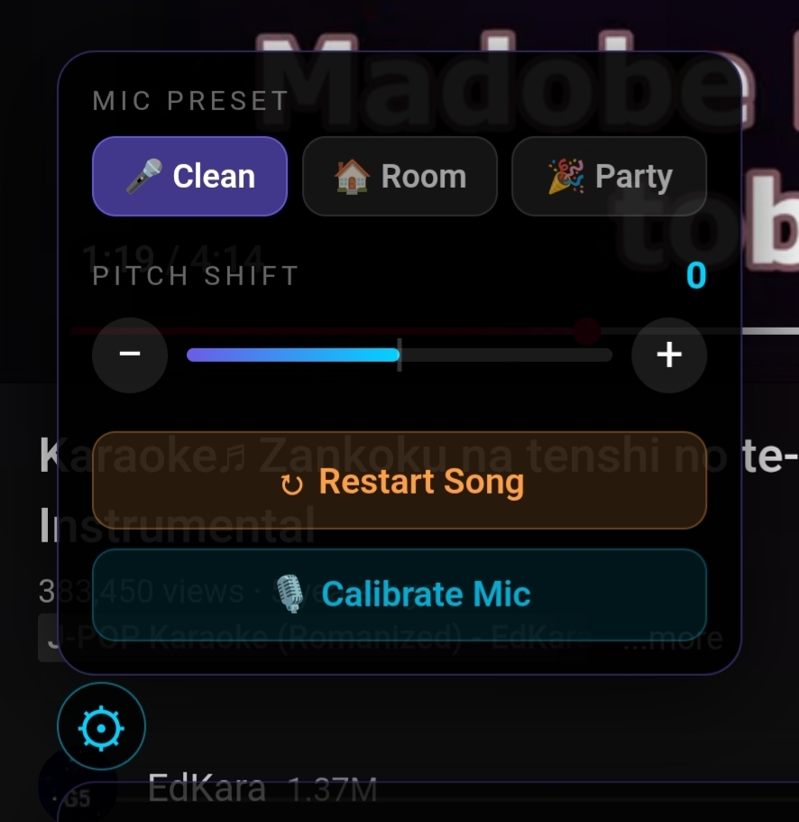

<p align="center">
  <picture>
    <source media="(prefers-color-scheme: dark)" srcset="docs/karaoke-full-dark.png">
    
  </picture>
</p>

<p align="center">
  <strong>Sing any YouTube song. Get scored in real-time.</strong>
</p>

---

Frank Karaoke wraps YouTube with a real-time singing scoring overlay. Search for any song on YouTube, sing along, and see your score update live. No pre-made song files needed — the app analyzes the video's audio and your voice simultaneously using pitch detection and signal processing.

Built with Flutter for Android.

## Screenshots

<p align="center">
  
</p>

*Real-time scoring overlay on top of a YouTube karaoke video. The pitch trail (bottom left) shows your singing in green dots, the score (bottom right) updates live, and the current note is displayed at top right.*

<p align="center">
  
</p>

*Detailed view of the scoring interface: live score with feedback text, overall score for the entire song, pitch trail canvas with note grid markers (C3-G5), and the gear icon for settings.*

<p align="center">
  
</p>

*Tap the score box to choose between 4 scoring modes. Each mode evaluates your singing differently — from precise pitch matching to combo-based streak scoring.*

<p align="center">
  
</p>

*Settings panel: choose a mic preset for your environment (clean external mic, room mic, or noisy party), adjust pitch shift for songs outside your vocal range, restart the song, or calibrate the mic for your room's noise level.*

## How It Works

1. **Open the app** — YouTube loads inside the app with the Frank Karaoke logo
2. **Search for a karaoke video** — any YouTube video works, but instrumental karaoke tracks give the best results
3. **Video pauses for setup** — the app briefly pauses playback to initialize the mic, download song data for the pitch oracle, and prepare the scoring overlay
4. **Sing along** — the video plays and your score updates in real-time based on your microphone input
5. **See your results** — the live score reflects your current performance, while the overall score tracks the entire song

The app injects an HTML/CSS overlay directly into the YouTube page via JavaScript — the scoring display, pitch trail, settings panel, and mode selector are all rendered inside the webview.

## Scoring: An Honest Explanation

### Why scoring is approximate

Traditional karaoke machines (SingStar, Joysound, DAM) ship with **pre-made melody reference files** for every song — they know exactly which note you should be singing at every moment. Frank Karaoke doesn't have that. Instead, it works with any YouTube video by analyzing the audio in real-time.

This means:

- **Without the pitch oracle** (when the reference audio download fails or times out), the app can only judge *how* you sing (pitch stability, melodic movement, interval quality), not *what* you should be singing. It can't tell if you're singing the right melody for this specific song.
- **With the pitch oracle** (when the reference audio downloads successfully), the app compares your voice against the video's audio to distinguish your singing from speaker bleed. This is better but still imprecise — the phone mic picks up both your voice and the speakers, and the reference audio is the full instrumental mix, not just the melody line.
- **The phone mic challenge**: On Android with the built-in mic, the microphone captures your voice *plus* the music playing from the speaker. The app uses a 200-3500 Hz bandpass filter to emphasize vocal frequencies and reduce instrumental bleed, but separation isn't perfect.

For detailed technical background, see [docs/scoring.md](docs/scoring.md).

### The 4 Scoring Modes

Each mode evaluates a different aspect of singing quality. Tap the score box during playback to switch modes.

#### 🎯 Pitch Match

**Best for:** Songs you know well

Scores how cleanly you hit musical notes. The app detects your pitch and checks if it lands precisely on a note (C, D, E...) rather than drifting between notes. Holding steady notes scores higher than wobbling. Uses the YIN algorithm for pitch detection with a bandpass filter to isolate vocal frequencies.

#### 〰️ Contour

**Best for:** Learning new songs

Scores the *shape* of your melody — are you going up when the melody goes up, and down when it goes down? This mode doesn't care which exact note you hit, only the direction and flow of your singing. Measures pitch range and significant melodic movement over a rolling window.

#### 📐 Intervals

**Best for:** Singing in a different key

Scores the *jumps* between consecutive notes. A step of 2 semitones (whole step) scores highest. Small musical intervals like thirds and fourths score well. Wild jumps of an octave or more score low. Rewards proper musical phrasing regardless of which key you're singing in. Uses a Gaussian scoring curve centered at the whole step.

#### 🔥 Streak

**Best for:** Parties and competition

Pitch scoring with a combo multiplier. Every consecutive good frame builds your streak counter (5x, 15x, 30x ON FIRE!). The longer the streak, the more bonus points. One bad note resets the counter to zero. Silence during instrumental breaks freezes the streak safely. The most dynamic and exciting mode.

### Why these scoring systems?

The choice is based on research from academic papers on singing assessment (Nakano et al. 2006, Tsai & Lee 2012) and analysis of how professional karaoke systems work. Without per-song reference data, these four approaches cover the main dimensions of vocal quality that can be measured from audio alone:

- **Intonation** (Pitch Match) — are you in tune?
- **Melodic shape** (Contour) — are you following the melody?
- **Phrasing** (Intervals) — are your note transitions musical?
- **Consistency** (Streak) — can you sustain quality over time?

Each produces genuinely different scores for the same performance, giving users variety and the ability to choose what matters most to them.

## Technical Stack

- **Flutter** — Android (primary target)
- **Riverpod** — state management
- **webview_flutter** — YouTube embedding
- **youtube_explode_dart** — audio stream extraction for the pitch oracle
- **record** — microphone PCM capture
- **audio_decoder** — reference audio decoding (Android MediaCodec)
- **YIN algorithm** — pitch detection (pure Dart implementation)
- **Bandpass filter** — 200-3500 Hz IIR filter for vocal isolation

## Building Locally

### Prerequisites

- [Flutter SDK](https://docs.flutter.dev/get-started/install) (3.10+)
- Android SDK with a device or emulator (API 24+)
- A physical Android device is recommended for mic testing

### Build and install

```bash
# Clone the repository
git clone <repo-url>
cd frank_karaoke

# Get dependencies
flutter pub get

# Run on a connected Android device
flutter run -d <device_id>

# Or build a debug APK for sideloading
flutter build apk --debug

# The APK will be at:
# build/app/outputs/flutter-apk/app-debug.apk
```

### Sideload the APK

1. Transfer `app-debug.apk` to your Android device
2. On the device, open the file and tap **Install**
3. You may need to enable "Install from unknown sources" in Settings > Security
4. Grant microphone permission when prompted on first use

### First use

1. The welcome screen explains the app and scoring modes
2. Tap the gear icon to open settings — **calibrate your mic** before singing (it takes 3 seconds and adapts to your room's noise level)
3. Search for a karaoke video and play it
4. Tap the score box to choose your preferred scoring mode
5. Sing!

## Project Structure

```
lib/
  core/           # constants, audio presets, scoring modes, logo assets
  features/
    audio/        # mic capture, pitch detection, bandpass filter, voice isolation, pitch oracle
    scoring/      # scoring engine, scoring session (multi-mode)
    overlay/      # HTML/CSS/JS overlay injected into YouTube webview
    youtube/      # webview, audio extraction, URL parser
  state/          # Riverpod providers
  ui/             # screens, theme
docs/
  IDEA.md         # original product vision
  scoring.md      # comprehensive scoring research and architecture
  screenshots/    # app screenshots
```

## Research

The scoring system is based on published research in singing assessment. See [docs/scoring.md](docs/scoring.md) for the full analysis covering:

- How SingStar, Joysound, and DAM karaoke machines score singing
- Academic papers on reference-free vocal quality assessment
- The pitch oracle architecture for speaker bleed detection
- Voice isolation challenges on Android's built-in mic
- Latency and sync considerations for Bluetooth speakers
- The implementation roadmap from current state to UltraSinger integration

## License

This project is for personal and educational use.
